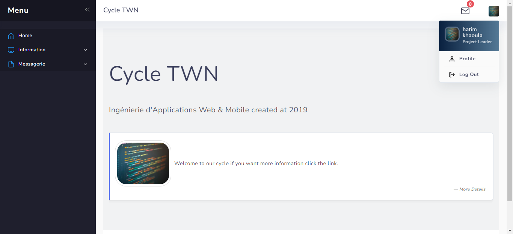

    

<!-- PROJECT LOGO -->
 

    
  <h2 align="center">application for class</h2>
  <h3 align="center">dynamic web page using  MVC.</h3>

<!-- TABLE OF CONTENTS -->

 <ol class="list-group list-group-numbered">
     <li class="list-group-item"> <a href="#Introduction">Introduction </a></li>
  <li class="list-group-item"> <a href="#Modélisation">Modélisation</a> </li>
  <li class="list-group-item"> <a href="#Les-outils-de-développement">Les outils de développement</a> </li>
   <li class="list-group-item"> <a href="#Les-interfaces-de-l’application">Les interfaces de l’application</a> </li>
</ol>

  
<!-- ABOUT THE PROJECT -->
## Introduction
    
 le but de cette application est offrir aux étudiants la possibilité de **s’inscrire** afin de **visualiser une description de la formation cycle d ingénierie TWM** avec une **description des module**s par semestre. Le compte administrateur doit permettre de **créer** le contenu et le **modifier**. De plus, il doit aussi pouvoir **gérer** les comptes utilisateurs.
     
 un service de **messagerie** interne aux étudiants du TWM (sans utiliser d’API de messagerie) à l’aide duquel les utilisateurs inscrits peuvent: 
    
  * envoyer des messages à leurs contacts
  * créer et gérer les groupes de contacts
  * recevoir et consulter des notifications des messages entrants
  * gérer les messages (recherche et suppression)

    

    
   
Overview of our application.

    
  

(<a href="#top">back to top</a>)

    

    

  
<!-- ABOUT THE PROJECT -->
## Modélisation
    
UML, c’est l’acronyme anglais pour « Unified Modeling Language ». On le traduit par « Langage de modélisation unifié ». La notation UML est un **langage visuel** constitué d’un ensemble de schémas, appelés des **diagrammes**, qui donnent chacun une vision différente du projet à traiter.
UML nous fournit donc des diagrammes pour **représenter** le logiciel à développer : son fonctionnement, sa mise en route, les actions susceptibles d’être effectuées par le logiciel, etc. 
    
UML est une démarche qui se base sur une approche objet. Cette approche s’appuie sur 4 principes fondamentaux. C’est une démarche :
    
  * Itérative et incrémentale.
  * Guidée par les besoins du client et des utilisateurs
  * Centrée sur l’architecture du logiciel
  * Qui décrit les actions et les informations dans une seule entité
    
    Réaliser ces diagrammes revient donc à **modéliser les besoins** et **les solutions fonctionnelles et techniques** de l’application à développer.
    
    
 1. Diagramme de cas d’utilisation.
    
    C’est un diagramme fonctionnel. Il montre les interactions fonctionnelles des acteurs et du système étudié. Il délimite précisément le système, décrit ce que fera le système sans spécifier comment. Il exprime les services (use cases) offert par le système aux utilisateurs (actors).
    
    
   

     
         
Diagramme de cas d’utilisation du admin et étudiant.

   
 
    
    
 2. Diagramme de cas d’utilisation.
    
    C’est une représentation utilisée dans la phase de conception d’une application pour présenter les classes entités et les différentes relations entre celles-ci.
    
    Une classe est constituée d’un ensemble de fonctions (méthodes) et de données (attributs).
    
    Donc voilà le diagramme de classes qu’on a adopté pour la conception de notre application :

  
   
    
     

     
         
Diagramme de classe de l’application.

   
 
                   
(<a href="#top">back to top</a>)
 
     
    

    
   
  
 

  
<!-- ABOUT THE PROJECT -->
## Les outils de développement 
    
Les outils de développement sont les outils nécessaires pour l’environnement de développement de l’application, et de même les différentes techniques web utilisées soient de back end ou de front end.

Parmi les outils de développement qu’on utiliser pour développer notre application sont :
     
    
     

    
     
     
     
   * **java EE**
     
         **Jakarta EE** (anciennement **Java 2 Platform**, **Enterprise Edition**, ou **J2EE** , puis **Java Platform**, **Enterprise Edition ou Java EE**), est une spécification pour la plate-forme **Java d'Oracle**, destinée aux applications d'entreprise.
         
     La plate-forme étend Java Platform, Standard Edition (Java SE) en fournissant une API de mapping objet-relationnel, des architectures distribuées et multitiers, et des services web. La plate-forme se fonde principalement sur des composants modulaires exécutés sur un serveur d'applications.
    
     

     
         
Logo de Java EE.

   

   
   * **Wamp** 
     
         **WampServer** est une plateforme de développement Web de type WAMP, permettant de faire fonctionner localement (sans avoir à se connecter à un serveur externe) des scripts **PHP**.
         
WampServer n'est pas en soi un logiciel, mais un environnement Comprenant :

   -	Trois serveurs (Apache, MySQL et MariaDB) .
   -	Un interpréteur de script (PHP).
   -	PhpMyAdmin pour l'administration Web des bases MySQL

 
     

     
         
Logo du WAMP.

   

   
   
      
   * **HTML**
     
        **L’Hype Text Markup Language**, généralement abrégé HTML, C’est un langage permettant d’écrire r de l’hypertexte, et c’est le langage de balisage conçu pour représenter les pages web
         
    
     

     
         
Logo de HTML.

   

   
  * **CSS** 
     
        **Cascading Style Sheets** , les feuilles de style en cascade forment un langage informatique qui  décrit   la   présentation   des   documents HTML et XML.  Les standards définissant CSS sont publiés par le World  Wide  Web Consortium (W3C). 
         

 
     

     
         
Logo du CSS.

   

   
   * **JS** 
     
        **JavaScript** est un langage de programmation de scripts principalement employé dans les pages web interactives mais aussi pour les serveurs. 
         

 
     

     
         
Logo du JS.

   

   
   
   * **BOOTSTRAP** 
     
**Bootstrap** est une collection d'outils utiles à la création du design (graphisme, animation et interactions avec la page dans le navigateur, etc.) de sites et d'applications web. C'est un ensemble qui contient des codes HTML et CSS, des formulaires, boutons, outils de navigation et autres éléments interactifs, ainsi que des extensions JavaScript en option. C'est l'un des projets les plus populaires.        

 
     

     
         
Logo de BOOTSTRAP.

   
  
   
   * **JQuery** 
     
**jQuery** est une bibliothèque JavaScript libre et multiplateforme créée pour faciliter l'écriture de scripts côté client dans le code HTML des pages web3. La première version est lancée en janvier 2006 par John Resig.        

 
     

     
         
Logo de JQuery.

   

   
   * **architect entreprise** 
     
    
C’est un logiciel de modélisation et de conception UML, édité par la société australienne Sparx Systems. Couvrant, par ses fonctionnalités, l'ensemble des étapes du cycle de conception d'application, il est l'un des logiciels de conception et de modélisation les plus reconnus.       

 
     

     
         
Logo d'Entreprise Architect.

   

   
   * **Eclipse IDE** 
     
Outils pour les développeurs Java créant des applications Java EE et Web, y compris un IDE Java, des outils pour Java EE et JSF, Mylyn et autres.       

 
     

     
         
Logo d'Eclipse IDE.

   

                            
   
   
   
   
   

  
<!-- ABOUT THE PROJECT -->
## Les interfaces de l’application 
    
   
     
    
   
    
   avant d'accéder a notre application on une page d'accueil.
     
     

     
         
page d'accueil.

   

   un utilisateur de notre application et un étudiant et il doit avoir un compte et etre enregistré avant d'accéder à l'application ,il y'a  deux type de compte:
   
   * admin(qui sont nous) .
   * étudiant.
   
   tout d'abord on l'interface pour créer un compte . 
    on crée compte admin.
     
     

     
         
compte admin.

   

   on crée deux compte pour étudiant.
    
     

     
         
compte souhaila.

   

    
     

     
         
compte amin.

   

   
   maintenant on passe au login.
   1. admin
    
     

     
         
login admin.

   

   quand il click sur log in l'admin accède la page principale de l'application.
    
     

     
         
page principale.

   

   
     * [QTableView](https://doc.qt.io/qt-5/qtableview.html#:~:text=A%20QTableView%20implements%20a%20table,by%20Qt's%20model%2Fview%20architecture.)
   * for the model i used QSqlQueryModel
     * [QTableView](https://doc.qt.io/qt-5/qsqlquerymodel.html)
   * for the database i used i local database 
     * [QSQLITE](https://doc.qt.io/qt-5/sql-driver.html)
 
Our Team - [darkaoui hatim](https://github.com/hatimdeve) - [khaoula oularbi](https://github.com/Khawla1609)
       
Project Link: [https://github.com/hatimdeve/todoapp](https://github.com/hatimdeve/todoapp)

   
(<a href="#top">back to top</a>)

